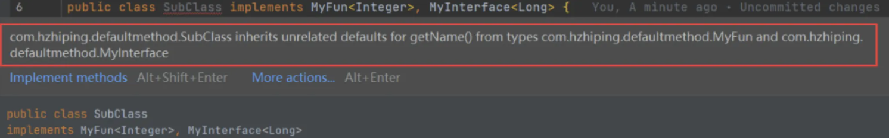

# 新特性简介

* 速度更快
* 代码更少【增加了新的语法 Lambda 表达式】
* 强大的 Stream【API】
* 便于并行
* 最大化减少空指针异常 Optional

其中最核心的是 Lambda 表达式和 Stream 的 API。

# Lambda 表达式

## 为啥使用 Lambda 表达式？

下面用一个具体的案例抛砖引玉，说明为什么要用 Lambda 表达式：

[<font style="color:#003884;">whylambda</font>](https://github.com/hzhiping/learn-code/tree/main/jdk08/src/main/java/com/hzhiping/whylambda)

Lambda 是一个匿名函数，我们可以把 Lambda 表达式理解为是一段可以传递的代码【将代码像数据一样进行传递】。可以写出更简洁、更灵活的代码。作为一种更紧凑的代码风格，使 Java 的语言表达能力得到了提升。

从匿名内部类到 Lambda 表达式的转换：

```java
// 匿名内部类
Runnable r1 = new Runnable() {
    @Override
    public void run() {
        System.out.println("Hello World");
    }
}
// 转换成 Lambda 表达式
Runnable r1 = () -> System.out.println("Hello World");
```

使用匿名内部类做为参数传递到 Lambda 表达式的转换：

```java
// 原来使用匿名内部类作为参数传递
TreeSet<String> ts = new TreeSet<>(new Comparator<String>() {
    @Override
    public int compare(String o1，String o2) {
        return Integer.compare(o1.1ength(), o2.length());
    }
});
// 转换成 Lambda 表达式
TreeSet<String> ts = new TreeSet<>(
    (o1, o2) -> Integer.compare(o1.length(), 02.lenth())
);
```

## Lambda 表达式语法

Lambda 表达式在 Java 语言中引入了一个新的语法元素和操作符。这个操作符为 ->，该操作符被称为 Lambda 操作符或剪头操作符。它将 Lambda 分为两个部分：

* 左侧：指定了 Lambda 表达式需要的所有参数
* 右侧：指定了 Lambda 体，即 Lambda 表达式要执行的功能

语法格式一：无参数，无返回值，Lambda 表达式只需要一条语句

```java
Runnable r1 = () -> System.out.println("Hello lambda!");
```

语法格式二：Lambda 需要一个参数

```java
Consumer<String> fun = (args) -> System.out.println(args);
```

语法格式三：Lambda 只需要一个参数时，参数的小括号可以省略

```java
Consumer<String> fun = args -> System.out.println(args);
```

语法格式四：Lambda 需要两个参数，并且有返回值

```java
BinaryOperator<Long> bo = (x, y) -> {
    System.out.println("实现函数接口方法");
    return x + y;
};
```

语法格式五：当 Lambda 体只有一条语句时，return 与大括号可以省略

```java
BinaryOperator<Long> bo = (x, y) -> x + y;
```

语法格式六：数据类型可以省略，因为可由编译器推断得出，称为“类型推断”，下面参数的 Long 可以省略

```java
BinaryOperator<Long> bo = (Long x, Long y) -> {
    System.out.println("实现函数接口方法");
    return x + y;
};
```

[<font style="color:#003884;">grammar</font>](https://github.com/hzhiping/learn-code/tree/main/jdk08/src/main/java/com/hzhiping/grammar)

## 类型推断

上述 Lambda 表达式中的参数类型都是由编译器推断得出的。Lambda 表达式中无需指定类型，程序依然可以编译，这是因为 javac 根据程序的上下文，在后台推断出了参数的类型。Lambda 表达式的类型依赖于上下文环境，是由编译器推断出来的，这就是所谓的“类型推断”。

## 练习

[<font style="color:#003884;">trainning</font>](https://github.com/hzhiping/learn-code/tree/main/jdk08/src/main/java/com/hzhiping/trainning)

# 函数式接口

## 什么是函数式接口？

* 只包含一个抽象方法的接口，称为函数式接口。
* 你可以通过 Lambda 表达式来创建该接口的对象【若 Lambda 表达式抛出一个受检异常，那么该异常需要在目标接口的抽象方法上进行声明】。
* 我们可以在任意函数式接口上使用 @FunctionalInterface 注解，这样做可以检查它是否是一个函数式接口，同时 javadoc 也会包含一条声明，说明这个接口是一个函数式接口。

## 自定义函数式接口

```java
@FunctionalInterface
public interface MyNumber {
    public double getValue();
}
```

函数式接口中使用泛型：

```java
@FunctionalInterface
public interface MyFunc<T> {
    public T getValue(T t);
}
```

## 作为参数传递 Lambda 表达式

```java
public String toUpperString(MyFunc<String> mf, String str) {
    return mf.getValue(str);
}
```

作为参数传递 Lambda 表达式：

```java
String newStr = toUpperString((str) -> str.toUpperCase(), "abcde");
System.out.println(newStr);
```

作为参数传递 Lambda 表达式：为了将 Lambda 表达式作为参数传递，接收 Lambda 表达式的参数类型必须是与该 Lambda 表达式兼容的函数式接口的类型。

## Java 内置函数式接口

Java 内置四大核心函数式接口：

| 函数式接口 | 接口类型 | 参数类型 | 返回类型 | 用途 |
| --- | --- | --- | --- | --- |
| Consumer<T> | 消费型接口 | T | void | 对类型为 T 的对象应用操作，包含方法 void accept(T t) |
| Supplier<T> | 供给型接口 | 无 | T | 返回类型为 T 的对象，包含方法：T get() |
| Function<T> | 函数型接口 | T | R | 对类型为 T 的对象应用操作，并返回结果。结果为 R 类型的对象。包含方法：R apply(T t) |
| Predicate<T> | 断定型接口 | T | boolean | 确定类型为 T 的对象是否满足某约束，并返回 boolean 值。包含方法：boolean test(T t) |


[<font style="color:#003884;">LambdaTest.java</font>](https://github.com/hzhiping/learn-code/blob/main/jdk08/src/main/java/com/hzhiping/internal/LambdaTest.java)

其他接口：

| 函数式接口 | 参数类型 | 返回类型 | 用途 |
| --- | --- | --- | --- |
| BiFunction<T, U, R> | T，U | R | 对类型为 T，U 参数应用操作，返回 R 类型的结果，包含方法为 R apply(T t, U u) |
| UnaryOperator<T>【Function 子接口】 | T | T | 对类型为 T 的对象进行一元运算，并返回 T 类型的结果，包含方法为 T apply(T t) |
| BinaryOperator<T>【BiFunction 子接口】 | T | T | 对类型为 T 的对象进行二元运算，并返回 T 类型的结果，包含方法为 T apply(T t1, T t2) |
| BiConsumer<T, U> | T，U | void | 对类型为 T，U 参数应用操作，包含方法为 void accept(T t, U u) |
| ToIntFunction<T>、ToLongFunction<T>、ToDoubleFunction<T> | T | int、long、double | 分别计算 int，long，double 值的函数 |
| IntFunction<R>、LongFunction<R>、DoubleFunction<R> | int、long、double | R | 参数分别为 int，long，double 类型的函数 |


# 方法引用与构造器引用

## 方法引用

当要传递给 Lambda 体的操作，已经有实现的方法了，可以使用方法引用【实现抽象方法的参数列表，必须与方法引用方法的参数列表保持一致】！

方法引用：使用操作符 :: 将方法名和对象或类的名字分隔开来。如下三种主要使用情况：

* 对象::实例方法
* 类::静态方法
* 类::实例方法

例如：

```java
(x) -> System.out.println(x);
// 等同于：
System.out::println;
```

例如：

```java
BinaryOperator<Double> bo = (x, y) -> Math.pow(x, y);
// 等同于
BinaryOperator<Double> bo = Math:pow
```

例如：

```java
compare((x, y) -> x.equals(y), "abcdef", "abcdef");
// 等同于
compare(String::equals, "abcdef", "abcdef");
```

注意：当需要引用方法的第一个参数是调用对象，并且第二个参数是需要引用方法的第二个参数【或无参数】时：ClassName::methodName。

## 构造器引用

格式：ClassName::new

与函数式接口相结合，自动与函数式接口中方法兼容。可以把构造器引用赋值给定义的方法，与构造器参数列表要与接口中抽象方法的参数列表一致！

例如：

```java
Function<Integer, MyClass> fun = (n) -> new MyClass(n);
// 等同于
Function<Integer, MyClass> fun = MyClass::new
```

## 数组引用

格式：type[]::new

例如：

```java
Function<Integer, Integer[]> fun = (n) -> new Integer[n];
// 等同于
Function<Integer, Integer[]> fun = Integer[]::new
```

[<font style="color:#003884;">method</font>](https://github.com/hzhiping/learn-code/tree/main/jdk08/src/main/java/com/hzhiping/method)

# Stream API

## 了解 Stream

Java 8 中有两大最为重要的改变。第一个是 Lambda 表达式；另外一个则是 Stream API【java.util.stream.*】。Stream 是 Java 8 中处理集合的关键抽象概念，它可以指定你希望对集合进行的操作，可以执行非常复杂的查找、过滤和映射数据等操作。使用 Stream API 对集合数据进行操作，就类似于使用 SQL 执行的数据库查询。也可以使用 Stream API 来并行执行操作。简而言之，Stream API 提供了一种高效且易于使用的处理数据的方式。

## 什么是 Stream

流【Stream】到底是什么呢？它本质上是数据渠道，用于操作数据源【集合、数组等】所生成的元素序列。

> “集合讲的是数据，流讲的是计算！”

注意：

* Stream 自己不会存储元素。
* Stream 不会改变源对象。相反，他们会返回一个持有结果的新 Stream。
* Stream 操作是延迟执行的。这意味着他们会等到需要结果的时候才执行。

## Stream 的操作三个步骤

* 创建 Stream：一个数据源【如：集合、数组】，获取一个流
* 中间操作：一个中间操作链，对数据源的数据进行处理
* 终止操作【终端操作】：一个终止操作，执行中间操作链，并产生结果


### 创建 Stream

**创建 Stream：**

Java 8 中的 Collection 接口被扩展，提供了两个获取流的方法：

+ default Stream<E> stream()：返回一个顺序流
+ default Stream<E> parallelStream()：返回一个并行流

**由数组创建流：**

Java 中的 Arrays 的静态方法 stream() 可以获取数组流：

static <T> Stream<T> stream(T[] array)：返回一个流

重载形式，能够处理对应基本类型的数组：

+ public static IntStream stream(int[] array)
+ public static LongStream stream(long[] array)
+ public static DoubleStream stream(double[] array)

**由值创建流：**

可以使用静态方法 Stream.of()，通过显示值创建一个流。它可以接收任意数量的参数：

public static<T> Stream<T> of(T... values)：返回一个流

**由函数创建流，创建无限流：**

可以使用静态方法 Stream.iterate() 和 Stream.generate()，创建无限流：

* 迭代：public static<T> Stream<T> iterate(final T seed, final UnaryOperator<T> f)
* 生成：public static<T> Stream<T> generate(Supplier<T> s)

[<font style="color:#003884;">StreamCreationTest.java</font>](https://github.com/hzhiping/learn-code/blob/main/jdk08/src/main/java/com/hzhiping/stream/StreamCreationTest.java)

### Stream 的中间操作

多个中间操作可以连接起来形成一个流水线，除非流水线上触发终止操作，否则中间操作不会执行任何的处理！而在终止操作时一次性全部处理，称为“惰性求值”。

**筛选与切片：**

* filter(Predicate p)：接受 Lambda，从流中排除某些元素
* distinct()：筛选，通过流所生成元素的 hashCode() 和 equals() 去除重复元素
* limit(long maxSize)：截断流，使其元素不超过给定数量
* skip(long n)：跳过元素，返回一个扔掉了前 n 个元素的流，若流中元素不足 n 个，则返回一个空流，与 limit(n) 互补

[<font style="color:#003884;">StreamFilterSliceTest.java</font>](https://github.com/hzhiping/learn-code/blob/main/jdk08/src/main/java/com/hzhiping/stream/StreamFilterSliceTest.java)

**映射：**

* map(Function f)：接收一个函数作为参数，该函数会被应用到每个函数上，并将其映射成一个新的元素
* mapToDouble(ToDoubleFuntion f)：接收一个函数作为参数，该函数会被应用到每个函数上，产生一个新的 DoubleStream
* mapToInt(ToIntFunction f)：接收一个函数作为参数，该函数会被应用到每个函数上，产生一个新的IntStream
* mapToLong(ToLongFunction f)：接收一个函数作为参数，该函数会被应用到每个函数上，产生一个新的LongStream
* flatMap(Function f)：接收一个函数作为参数，将流中的每一个值都换成另外一个流，然后把所有的流连接成一个流

[<font style="color:#003884;">StreamMapTest.java</font>](https://github.com/hzhiping/learn-code/blob/main/jdk08/src/main/java/com/hzhiping/stream/StreamMapTest.java)

**排序：**

* sorted()：产生一个新流，其中按自然顺序排序
* sorted(Comparator comp)：产生一个新流，其中按比较器顺序排序

[<font style="color:#003884;">StreamSortTest.java</font>](https://github.com/hzhiping/learn-code/blob/main/jdk08/src/main/java/com/hzhiping/stream/StreamSortTest.java)

### Stream 的终止操作

终端操作会从流的流水线生成结果。其结果可以是任何不是流的值，例如：List、Integer，甚至是 void。

**查找与匹配：**

* allMath(Predicate p)：检查是否匹配所有元素
* anyMatch(Predicate p)：检查是否匹配至少一个元素
* noneMatch(Predicate p)：检查是否没有匹配所有元素
* findFirst()：返回第一个元素
* findAny()：返回当前流中的任意元素
* count()：返回流中元素总数
* max(Comparator c)：返回流中最大值
* min(Comparator c)：返回流中最小值
* foreach(Comparator c)：内部迭代【使用 Collection 接口需要用户去做迭代，称为外部迭代。相反，Stream API 使用内部迭代---它帮你把迭代做了】

[<font style="color:#003884;">StreamTerminateTest.java</font>](https://github.com/hzhiping/learn-code/blob/main/jdk08/src/main/java/com/hzhiping/stream/StreamTerminateTest.java)

**规约：**

* reduce(T iden, BinaryOperator b)：可以将流中元素反复结合起来，得到一个值。返回 T
* reduce(BinaryOperator b)：可以将流中元素反复结合起来，得到一个值。返回 Option<T>

备注：map 和 reduce 的连接通常称为 map-reduce 模式，因 Google 用它来进行网络搜索而出名。

**收集：**

* collect(Collector c)：将流转换为其他形式。接收一个 Collector 接口的实现，用于给 Stream 中元素做汇总的方法。

Collector 接口中方法的实现决定了如何对流执行收集操作【如收集到 List、Set、Map】。但是 Collectors 实用类提供了很多静态方法，可以方便地创建常见收集器实例，具体方法与实例如下：

* Collectors.toList()：返回 List<T> 类型，用于把流中元素收集到 List
* Collectors.toSet()：返回 Set<T> 类型，用于把流中元素收集到 Set
* Collectors.toCollection()：返回 Collection<T> 类型，用于把流中元素收集到创建的集合
* Collectors.counting()：返回 Long 类型，用于计算流中元素的个数
* Collectors.summingInt()：返回 Integer 类型，用于对流中元素的整数属性求和
* Collectors.averagingInt()：返回 Double 类型，计算流中元素 Integer 属性的平均值
* Collectors.summarizingInt()：返回 IntSummaryStatistics 类型，用于收集流中 Integer 属性的统计值，如：平均值
* Collectors.joining()：返回 String 类型，连接流中每个字符串
* Collectors.maxBy()：返回 Optional<T> 类型，根据比较器选择最大值
* Collectors.minBy()：返回 Optional<T> 类型，根据比较器选择最小值
* Collectors.reducing()：返回规约产生的类型，从一个作为累加器的初始值开始，利用 BinaryOperator 与流中元素逐个结合，从而规约成单个值
* Collectors.collectingAndThen()：返回转换函数返回的类型，包裹另一个收集器，对其结果转换函数
* Collectors.groupingBy()：返回 Map<K, List<T>> 类型，根据某属性值对流分组，属性为 K，结果为 V
* Collectors.partitioningBy()：返回 Map<Boolean, List<T>> 类型，根据 true 或 false 进行分区

[<font style="color:#003884;">StreamReduceTest.java</font>](https://github.com/hzhiping/learn-code/blob/main/jdk08/src/main/java/com/hzhiping/stream/StreamReduceTest.java)

### Stream练习

[<font style="color:#003884;">StreamTrainingTest.java</font>](https://github.com/hzhiping/learn-code/blob/main/jdk08/src/main/java/com/hzhiping/stream/StreamTrainingTest.java)

## 并行流与串行流

并行流就是把一个内容分成多个数据块，并用不同的线程分别处理每个数据块的流。

Java 8 中将并行进行了优化，我们可以很容易的对数据进行并行操作。Stream API 可以声明性地通过 parallel() 与 sequential() 在并行流与顺序流之间进行切换。

## 了解 Fork 和 Join 框架

### Fork 和 Join 的简介

Fork/Join 框架：就是在必要的情况下，将一个大任务，进行拆分【Fork】成若干个小任务【拆到不可再拆时】，再将一个个的小任务运算的结果进行 Join 汇总。


### Fork / Join 框架与传统线程池的区别

采用“工作窃取”模式【Work-Stealing】：

当执行新的任务时它可以将其拆分分成更小的任务执行，并将小任务加到线程队列中，然后再从一个随机线程的队列中偷一个并把它放在自己的队列中。

相对于一般的线程池实现，Fork / Join 框架的优势体现在对其中包含的任务的处理方式上。在一般的线程池中，如果一个线程正在执行的任务由于某些原因无法继续运行，那么该线程会处于等待状态。而在 Fork / Join 框架实现中，如果某个子问题由于等待另外一个子问题的完成而无法继续运行。那么处理该子问题的线程会主动寻找其他尚未运行的子问题来执行。这种方式减少了线程的等待时间，提高了性能。

[<font style="color:#003884;">forkjoin</font>](https://github.com/hzhiping/learn-code/tree/main/jdk08/src/main/java/com/hzhiping/forkjoin)

# Optional 类

Optional<T> 类【java.util.Optional】是一个容器类，代表一个值存在或不存在，原来用 null 表示一个值不存在，现在 Optional 可以更好的表达这个概念。并且可以避免空指针异常。

常用的方法：

* Optional.of(T t)：创建一个 Optional 实例
* Optional.empty()：创建一个空的 Optional 实例
* Optional.ofNullable(T t)：若 t 不为 null，创建 Optional 实例，否则创建空实例
* isPresent()：判断是否包含值
* orElse(T t)：如果调用对象包含值，返回该值，否则返回 t
* orElseGet(Supplier s)：如果调用对象包含值，返回该值，否则返回 s 获取的值
* map(Function f)：如果有值对其处理，并返回处理后的 Optional，否则返回 Optional.empty()
* flatMap(Function mapper)：与 map 类似，要求返回值必须是 Optional

[<font style="color:#003884;">optional</font>](https://github.com/hzhiping/learn-code/tree/main/jdk08/src/main/java/com/hzhiping/optional)

# 接口中的默认方法与静态方法

## 接口中的默认方法

Java 8 中允许接口中包含具有具体实现的方法，该方法称为“默认方法”，默认方法使用 default 关键字修饰。

例如：

[<font style="color:#003884;">MyFun.java</font>](https://github.com/hzhiping/learn-code/blob/main/jdk08/src/main/java/com/hzhiping/defaultmethod/MyFun.java)

**接口默认方法的“类优先”原则**

若一个接口中定义了一个默认方法，而另外一个父类或接口中又定义了一个同名的方法时：

选择父类中的方法。如果一个父类提供了具体的实现，那么接口中具有相同名称和参数的默认方法会被忽略。

接口冲突。如果一个父接口提供一个默认方法，而另一个接口也提供了一个具有相同名称和参数列表的方法【不管方法是否是默认方法】，那么必须覆盖该方法来解决冲突。

[<font style="color:#003884;">defaultmethod</font>](https://github.com/hzhiping/learn-code/tree/main/jdk08/src/main/java/com/hzhiping/defaultmethod)



上图演示了接口冲突的情况。

# 新时间日期 API

## 使用 LocalDate、LocalTime、LocalDateTime

LocalDate、LocalTime、LocalDateTime 类的实例是不可变的对象，分别表示使用 ISO-8601 日历系统的日期、时间、日期和时间。它们提供了简单的日期或时间，并不包含当前的时间信息。也不包含与时区相关的信息。

> ISO-8601 日历系统是国际标准化组织制定的现代公民的日期和时间的表示法。

对应的具体方法见：[<font style="color:#003884;">https://docs.oracle.com/javase/8/docs/api/</font>](https://docs.oracle.com/javase/8/docs/api/)

## Instant 时间戳

用于“时间戳”的运算。它是以 Unix 元年【传统的设定为 UTC 时区 1970 年 1 月 1 日午夜时分】开始所经历的描述进行运算。

## Duration 和 Period

* Duration：用于计算两个“时间”间隔
* Period：用于计算两个“日期”间隔

## 日期的操纵

* TemporalAdjuster：时间校正器。有时我们可能需要获取例如：将日期调整到“下个周日”等操作。
* TemporalAdjusters：该类通过静态方法提供了大量的常用 TemporalAdjuster 的实现。

## 解析和格式化

java.time.format.DateTimeFormatter 类，该类提供了三种格式化方法：

* 预定义的标准格式
* 语言环境相关的格式
* 自定义的格式

## 时区的处理

Java 8 中加入了对时区的支持，带时区的时间为分别为：ZonedDate、ZonedTime、ZonedDateTime。

其中每个时区都对应着 ID，地区 ID 都为 “{区域}/{城市}”的格式，例如：Asia/Shanghai 等。

ZoneId 类中包含了所有的时区信息：

* getAvailableZoneIds()：可以获取所有时区时区信息
* of(id)：用指定的时区信息获取 ZoneId 对象

[<font style="color:#003884;">newdatetimeapi</font>](https://github.com/hzhiping/learn-code/tree/main/jdk08/src/main/java/com/hzhiping/newdatetimeapi)

# 其他新特性

## 重复注解和类型注解

Java 8 对注解处理提供了两点改进：可重复的注解及可用于类型的注解。

[<font style="color:#003884;">annotation</font>](https://github.com/hzhiping/learn-code/tree/main/jdk08/src/main/java/com/hzhiping/annotation)