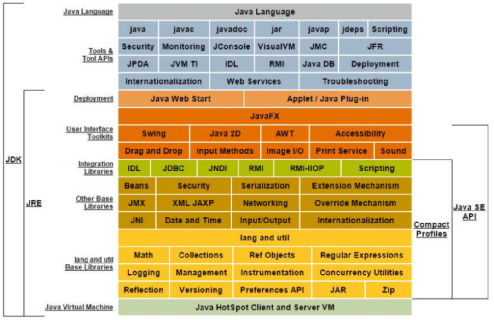
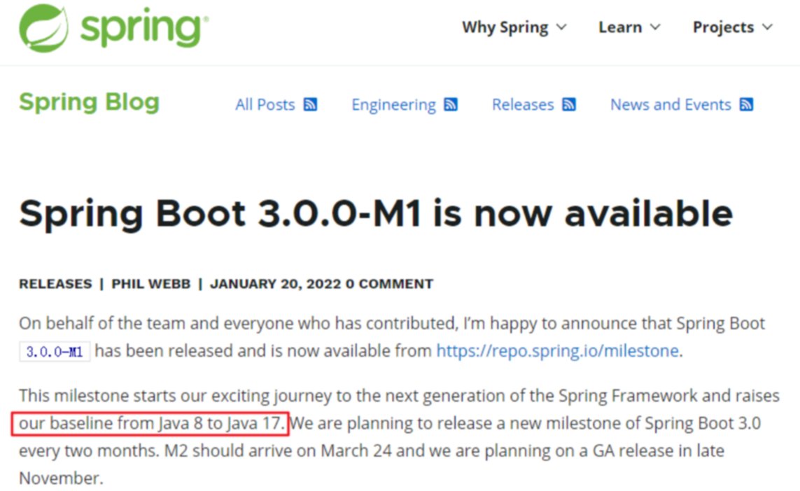

# 什么是 JDK、JRE

JDK【Java Development Kit】：是 Java 程序开发工具包，包含 JRE 和开发人员使用的工具。

JRE【Java Runtime Environment】：是 Java 程序的运行时环境，包含 JVM 和运行时所需要的核心类库。

如下是 Java 8.0 Platform：



小结：

* JDK = JRE + 开发工具集【例如 javac 编译工具等】
* JRE = JVM + Java SE 标准类库

## JDK 版本选择


* 自 Java 8 版本发布以来，其后的每次更新，都会有小伙伴高呼：Java8 YYDS！
* 论坛的声音：“你发任你发，我用 Java 8！”

数据说话 1：

JRebel 于 2022 年 4 月前后发布了《2022 年 Java 生态系统状况报告》，报告中提到使用 Java 11 的占比最多，Java 8 紧随其后，如下图。而此前 2020 年的报告显示，Java 8 占比达到了 84.48%。


我的分析：

G1 是最受欢迎的 GC 算法。Java 11 及更高版本的 G1 收集器是默认的 GC，而 Java 8 中并不是。出于对 G1 的喜爱，很多开发者才会选择抛弃 Java 8。

数据说话 2：

此外，某美国软件开发商在对近千名专业的 Java 开发者调研后，发布的《2022 年 Java 开发者生产力报告》称：八年前发布的 Java 8 依然是 Java 中应用最广泛的版本，占比 37%，其次是 Java 11，占比 29%。


Spring 框架说话：

在 Java 17 正式发布之前，Java 开发框架 Spring 率先在官博宣布，Spring Framework 6 和 SpringBoot 3 计划在 2022 年第四季度实现总体可用性的高端基线：

* Java 17+【来自 Spring Framework 5.3.x 线中的 Java 8-17】
* Jakarta EE 9+【来自 Spring 框架 5.3.x 线中的 Java EE 7-8】

Spring 官方说明：



意味着：SpringBoot 3.0 是需要用 Java 17 和 Spring 6.0 为基础建设。如果从企业选型最新 SpringBoot 3.0 作为架构来说，它搭配 JDK 17 肯定是标配了。

# JDK 下载

下载网址【Oracle 公司官网】：[Oracle 官网](https://www.oracle.com/)

# Windows 安装 JDK

1、双击即可执行安装，如下所示：


2、选择安装，这里仅仅选择开发工具，另外的源代码后面可以用反编译进行查看，公共JRE也是不需要安装的，然后点击更改，修改安装路径：


> 公共 JRE 是一个独立的 JRE 系统，会单独安装在系统的其他路径下。公用 JRE 会向 Internet Explorer 浏览器和系统中注册 Java 运行时环境。通过这种方式，系统中任何应用程序都可以使用公用 JRE。由于现在在网页上执行 Applet 的机会越来越少，而且完全可以选择使用 JDK 目录下的 JRE 来运行 Java 程序，因此没有太大必要安装公共 JRE。

3、配置环境变量：此电脑 —> 属性 —> 高级系统设置 —> 高级 —> 环境变量，在这里我们需要配置三个东西，分别是 JAVA_HOME、Path、CLASSPATH：


最后是配置 CLASSPATH，注意 CLASSPATH 格式，具体内容如下所示：

```
.;%JAVA_HOME%\lib;%JAVA_HOME%\lib\dt.jar;%JAVA_HOME%\lib\tools.jar
```

这样子，在 Windows 中配置 JDK 就完成了。我们在 DOS 界面进行验证：


# Linux 中安装编译器

系统环境：CentOS 7、jdk1.8.0_161

## 卸载系统自带 JDK

首先需要卸载自带的 JDK，以便使用我们自己安装的 JDK 版本，命令如下：

```bash
# 查找自带的 JDK
$ rpm -qa | grep jdk
# 卸载该 JDK
$ rpm -e --nodeps java-1.5.0-gcj-1.5.0.0-29.1.el6.x86_64
```

## 下载

首先要到官网下载 Linux 的版本的 JDK，[下载链接](http://www.oracle.com/technetwork/java/javase/downloads/jdk8-downloads-2133151.html)。

## 解压

下载完了之后，将下载的软件包上传到 Linux 上，然后解压即可：

```bash
$ tar zxf jdk-8u11-linux-x64.tar.gz -C /usr/local
```

## 配置环境变量

当我们解压完成之后，需要配置环境变量，在 /etc/profile 文件追加相关内容：

```bash
# 设置 JAVA_HOME
export JAVA_HOME=/usr/local/jdk1.8.0_161
export JRE_HOME=/usr/local/jdk1.8.0_161/jre
export CLASSPATH=.:$JAVA_HOME/lib/dt.jar:$JAVA_HOME/lib/tools.jar:$JRE_HOME/lib
export PATH=$PATH:$JAVA_HOME/bin
```

## 刷新环境变量

```bash
source /etc/profile
```

## 测试安装

```bash
$ java -version
java version "1.8.0_161"
Java(TM) SE Runtime Environment (build 1.8.0_161-b12)
Java HotSpot(TM) 64-Bit Server VM (build 25.161-b12, mixed mode)
```

# 文件结构

**安装完成后，可在 JDK 安装路径下看到如下的文件路径：**

* bin：该路径下存放了 JDK 的各种工具命令，常用的 javac、java 等命令就放在该路径下。 
* db：该路径是安装 Java DB 的路径。
* demo：该路径下存放了 JDK 提供的演示代码，初学者可以参考这些演示代码。
* jre：该路径下安装的就是运行 Java 程序所必需的 JRE 环境。
* lib：该路径下存放的是 JDK 工具命令的实际执行程序。
* sample：该路径下存放了 JDK 提供的一些简单示例代码，初学者可以参考这些示例代码。
* src.zip：该压缩文件里存放的就是 Java 所有核心类库的源代码。
* README 和 LICENSE 等说明性文档。

在上面路径中，bin 路径是一个非常有用的路径，这个路径下包含了编译和运行 Java 程序的 javac 和 java 两个命令。除此之外，还包含了 appletviewer、jar 等大量工具命令。